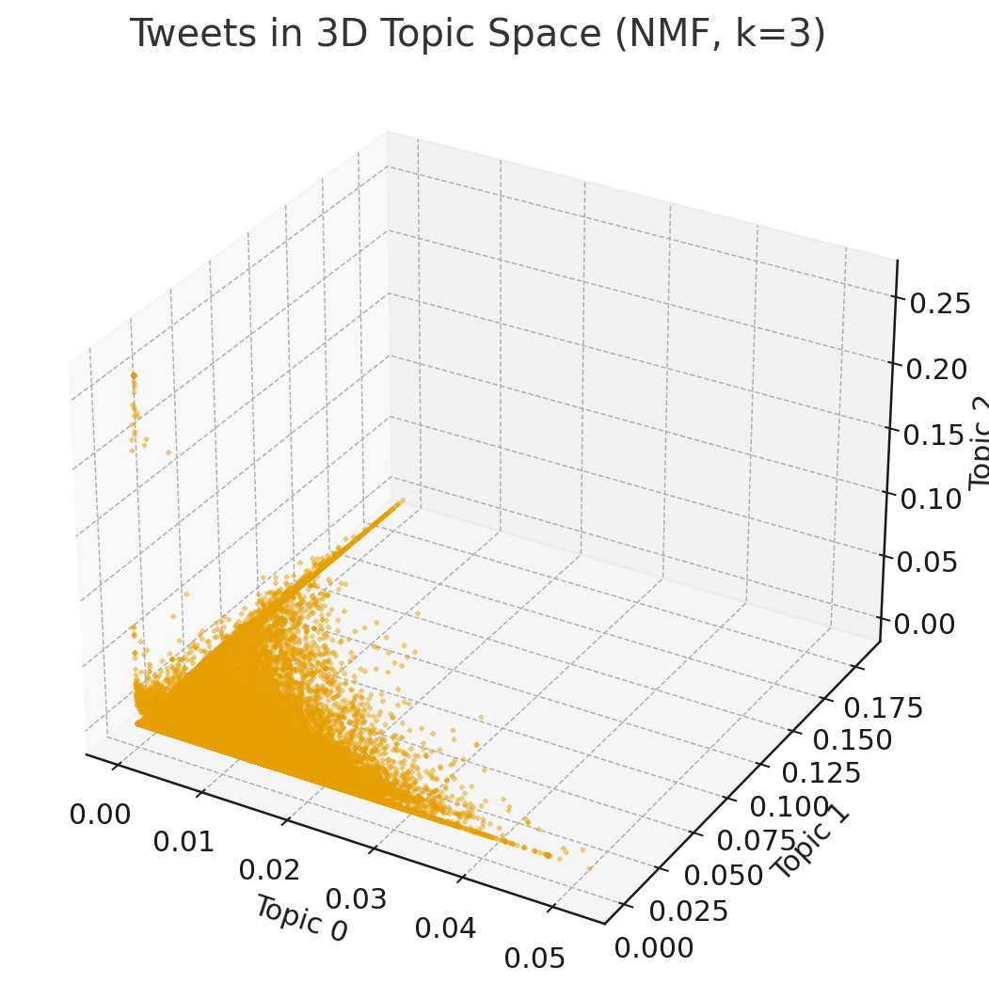

# Machine-Learning
# 🧠 COVID-19 Twitter Topic Modeling using NMF

This project applies unsupervised learning and topic modeling to analyze over 100,000 English tweets related to COVID-19, using TF-IDF vectorization and Non-negative Matrix Factorization (NMF).

## 🔍 Project Objectives
- Explore semantic themes and latent topics in social media during the early pandemic.
- Apply NMF to discover low-dimensional topic embeddings.
- Visualize tweet clusters in topic space and identify topic-specific keywords.

## 🛠️ Tools & Technologies
- Python (Pandas, NumPy, scikit-learn, NLTK, Matplotlib)
- NMF for topic modeling
- TF-IDF for document-term matrix construction
- 3D scatter plots for tweet visualization

## 📊 Sample Output

**3D Visualization of Tweet Embeddings**


## 🗂️ Folder Structure
notebooks/ → Jupyter notebook with full pipeline
data/ → Sample tweet CSV (anonymized)
src/ → Reusable functions for preprocessing, modeling
images/ → Generated visualizations

## 📁 Data Source
Dataset: [Kaggle COVID-19 Twitter Dataset](https://www.kaggle.com/smid80/coronavirus-covid19-tweets)

*Note: For privacy, only a sample subset of the dataset is included.*

## 🚀 How to Run
```bash
# Create virtual environment
python -m venv venv
source venv/bin/activate  # or venv\Scripts\activate on Windows

# Install dependencies
pip install -r requirements.txt

# Open Jupyter Notebook
jupyter notebook notebooks/topic_modeling.ipynb
